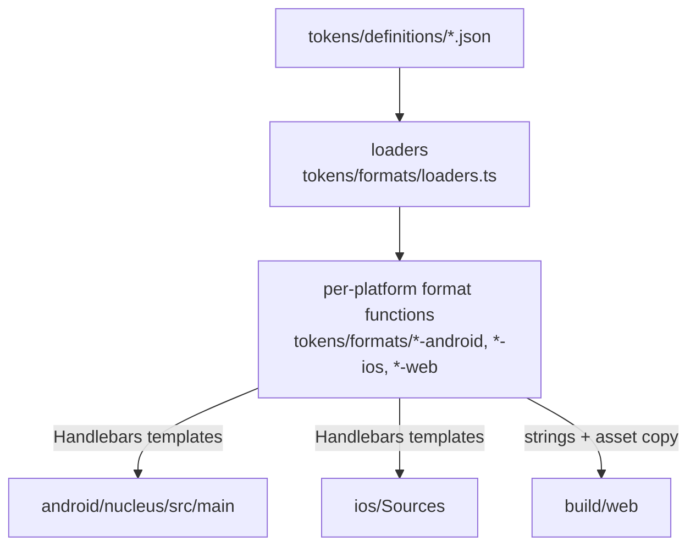

# Contributing to Nucleus

## Architecture

Tokens are authored as JSON in `tokens/definitions/`. A TypeScript build pipeline reads the JSON through a validating loader, runs format-specific generators, and writes platform-native source files into the repo. The generated files are committed; CI verifies they are in sync with the source JSON on every PR.



**Design principles**

- **JSON is the single source of truth.** Every platform output is derived from the same JSON; nothing is hand-edited downstream.
- **Source layers are explicit in token paths.** Color tokens live under `primitive.color.*` and `semantic.color.*`. Font tokens are split into a `families` block (font files) and a `tokens` block (typography styles).
- **Platform outputs are standalone.** No app-specific dependencies. Android gets Compose `Color` / `NucleusFontStyle` values; iOS gets a `NucleusColor` struct and a `NucleusFont` struct; web gets CSS custom properties + JSON.
- **Generated files are committed.** CI runs `npm run build` then `git diff --exit-code` to ensure the source and generated outputs stay in sync.

## Building

```bash
npm ci
npm run build
```

Generated files appear in:

| Platform | Path | Contents |
| --- | --- | --- |
| Android | `android/nucleus/src/main/java/com/worldcoin/nucleus/tokens/` | Kotlin objects (`NucleusPrimitiveColors`, `NucleusSemanticColorsLight`/`Dark`, `NucleusFonts`) shipped in the `android/nucleus` Maven artifact |
| Android | `android/nucleus/src/main/res/font/` | Bundled font files (`.ttf`) |
| iOS | `ios/Sources/NucleusColors/` | `NucleusColor` struct + generated `NucleusColor+Primitives.swift` and `NucleusColor+Semantics.swift` (SPM library `NucleusColors`) |
| iOS | `ios/Sources/NucleusFonts/` | `NucleusFont` struct + generated `NucleusFont+Defaults.swift` and bundled font resources (SPM library `NucleusFonts`) |
| Web | `build/web/` | CSS custom properties (`nucleus-*.css`), JSON token files, font files, `package.json` for npm publishing |

The repo-root `VERSION` file is the canonical version. `npm run build` stamps it into the web `package.json`; the Android library reads it from `build.gradle.kts`; SPM consumes the SPM tag.


## Adding or modifying tokens

1. Edit the relevant JSON file in `tokens/definitions/`. The loader validates the shape at build time and throws a clear error if a field is missing or malformed.
2. Run `npm run build` to regenerate platform sources and verify output.
3. Commit both the source change _and_ the regenerated files (CI enforces this with `git diff --exit-code`).
4. Open a PR with a release label (`patch`, `minor`, or `major`).

For new typography tokens: add the font file to `tokens/definitions/font/`, declare it in the `families` block of `fonts.json`, then reference it from the token. The Android resource name is derived by snake-casing the filename.

## CI

The verification workflow (`.github/workflows/verify.yml`) runs `format:check`, `lint`, `typecheck`, `build`, and the codegen-in-sync check on every push to `main` and every PR.

## Releases

Release automation is split across two workflows:

- `.github/workflows/prepare-release.yml` — prepares release PRs
- `.github/workflows/publish-release.yml` — tags and publishes merged release PRs

The prepare workflow runs in two modes:

- **Push to `main`** after merging a PR with a release label (`major`, `minor`, `patch`) — the workflow derives the bump from the merged PR, creates a `release/v*` branch, and opens a release PR.
- **Manual dispatch** — choose the bump type from the Actions UI to create the same release PR flow without a source PR label.

If the computed tag already exists, `prepare-release.yml` skips instead of opening a duplicate.

### Pipeline steps

1. **Release PR creation** — `prepare-release.yml` determines the next version, updates `VERSION`, `package.json`, `package-lock.json`, and `CHANGELOG.md`, then opens a `release/v*` PR.
2. **Release PR merge** — merging that PR back into `main` triggers `publish-release.yml`.
3. **Tag + build** — the merged release commit is tagged as `v*`, then `npm run build` runs and uploads `android-tokens`, `ios-tokens`, and `web-tokens`.
4. **publish-mvn** — publishes the Android library to GitHub Packages.
5. **publish-spm** — commits generated iOS files to the `generated/ios` branch, tags as `v*-ios`.
6. **publish-npm** / **publish-gh-packages** — two independent jobs publish the web package (`@worldcoin/nucleus`): the primary to the public npm registry (requires an `NPM_TOKEN` repo secret with publish rights to the `@worldcoin` npm org) and a backup mirror to GitHub Packages. One failing doesn't block the other.

`publish-release.yml` only publishes the first time it creates the `v*` tag. Reruns after that tag exists skip the publish jobs.

## Example apps

- `examples/android/` — Android demo with `local` and `package` flavors
- `examples/ios/` — iOS demo with `Local` and `Package` schemes
- `examples/web/` — Next.js demo with `local` and `package` token sources
