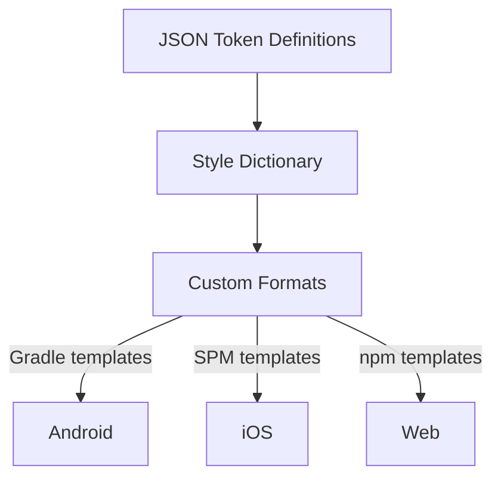

# Nucleus

A cross-platform design system for the World ecosystem.

## Architecture

**Source layers are explicit in token paths** – token definitions use `primitive.color.*` and `semantic.color.*` roots, so layer identity lives in the token schema instead of the folder structure.

**Primitive and semantic colors are exported** – Primitive values remain public, and light/dark semantic layers now build as separate themed outputs.

**Platform outputs are standalone** – no dependency on app-specific types. Android gets Compose `Color` objects; iOS gets raw hex `String` constants; Web gets CSS custom properties and JSON files. The consuming app bridges these to its own types.

## Token Build Pipeline



## Quick Start

```bash
npm install
npm run build
```

Generated files appear in `build/`:

| Platform | Path             | Contents                                                                            |
| -------- | ---------------- | ----------------------------------------------------------------------------------- |
| Android  | `build/android/` | Kotlin objects with Compose `Color` values, `build.gradle.kts` for Maven publishing |
| iOS      | `build/ios/`     | Standalone Swift enums with hex string constants, `Package.swift` for SPM           |
| Web      | `build/web/`     | CSS custom properties, JSON token files, `package.json` for npm publishing          |

Release versioning lives in the repo root `VERSION` file. Generated Android and Web artifacts stamp that exact value during `npm run build`, and the publish workflow synchronizes npm metadata from it before tagging a release.

## Token Source Layout

| Path | Description |
| ---- | ----------- |
| `src/tokens/color/primitive.json` | Primitive color tokens under `primitive.color.*` |
| `src/tokens/color/semantic.light.json` | Light semantic color tokens under `semantic.color.*` |
| `src/tokens/color/semantic.dark.json` | Dark semantic color tokens under `semantic.color.*` |

## Generated Output

### Android

- `NucleusPrimitiveColors` – Primitive colors as `Color` objects
- `NucleusSemanticColorsLight` – Light semantic colors as `Color` objects
- `NucleusSemanticColorsDark` – Dark semantic colors as `Color` objects

### iOS

- `NucleusPrimitiveColors` – Primitive colors as hex `String` constants
- `NucleusSemanticColorsLight` – Light semantic colors as hex `String` constants
- `NucleusSemanticColorsDark` – Dark semantic colors as hex `String` constants

### Web

- `nucleus-primitive-colors.css` – Primitive colors as CSS custom properties (`--nucleus-*`)
- `nucleus-primitive-colors.json` – JSON token file for programmatic use
- `nucleus-semantic-colors-light.css` / `nucleus-semantic-colors-dark.css` – Theme-specific semantic CSS custom properties
- `nucleus-semantic-colors-light.json` / `nucleus-semantic-colors-dark.json` – Theme-specific semantic JSON token files

## Example Apps

- `playground/android/` – Android demo app that wraps generated Kotlin sources from `build/android`
- `playground/ios/` – iOS demo app that compiles the generated Swift file from `build/ios`
- `playground/web/` – Web demo app that reads generated files from `build/web`

## CI/CD

The GitHub Actions workflow (`.github/workflows/publish.yml`) supports two trigger modes:

- **Merged PR with a release label** (`major`, `minor`, `patch`) – auto-bumps version, creates a tag, builds, and publishes
- **Manual dispatch** – choose the bump type from the Actions UI

### Pipeline Steps

1. **release** – Determines version bump, updates `VERSION` and release metadata, commits, creates a `v*` tag
2. **build** – Runs `npm run build`, uploads `android-tokens`, `ios-tokens`, and `web-tokens` artifacts
3. **publish-maven** – Publishes Android library to GitHub Packages
4. **publish-spm** – Commits generated iOS files to the `generated/ios` branch, tags as `v*-ios`
5. **publish-npm** – Publishes Web package to GitHub Packages npm registry

## Consuming the Tokens

### Android

Add the GitHub Packages Maven repository to `settings.gradle`:

```groovy
maven {
    url = uri("https://maven.pkg.github.com/worldcoin/nucleus")
    credentials {
        username = System.getenv("GITHUB_USER")
        password = System.getenv("GITHUB_TOKEN")
    }
}
```

Then add the dependency:

```groovy
implementation "com.worldcoin:nucleus:<version>"
```

Access primitive colors via `NucleusPrimitiveColors`.

### iOS

Add the SPM dependency in your `Package.swift`:

```swift
.package(url: "https://github.com/worldcoin/nucleus.git", branch: "generated/ios")
```

Or pin to a specific release tag (e.g. `v0.1.0-ios`).

Then add `Nucleus` as a dependency on your target:

```swift
.target(
    name: "YourTarget",
    dependencies: [
        .product(name: "Nucleus", package: "nucleus"),
    ]
)
```

Access primitive colors as hex strings:

```swift
import Nucleus

let hex = NucleusPrimitiveColors.grey900 // "181818"
```

### Web

Add a `.npmrc` to your project:

```
@worldcoin:registry=https://npm.pkg.github.com
```

Then install the package:

```bash
npm install @worldcoin/nucleus
```

**CSS custom properties** – import the stylesheet:

```css
@import "@worldcoin/nucleus/nucleus-primitive-colors.css";
```

Then use the variables:

```css
.card {
  color: var(--nucleus-grey-900);
  border: 1px solid var(--nucleus-grey-200);
}
```

**JSON tokens** – import directly for JS/TS usage:

```ts
import tokens from "@worldcoin/nucleus/nucleus-primitive-colors.json";
```

## Adding / Modifying Tokens

1. Edit the relevant JSON file in `src/tokens/`
2. Run `npm run build` to verify output
3. Open a PR with a release label (`patch`, `minor`, or `major`)
4. On merge, CI auto-tags and publishes to all three platforms
