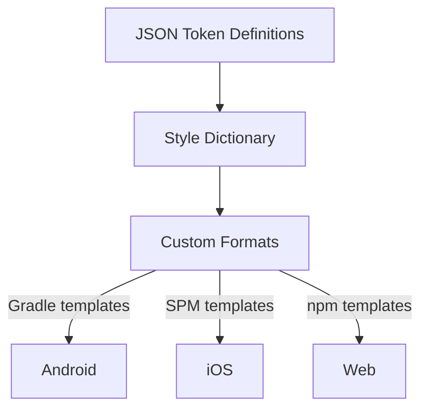

# Nucleus

A cross-platform design system for the World ecosystem.

## Architecture

**Source layers are explicit in token paths** – token definitions use `primitive.color.*` and `semantic.color.*` roots, so layer identity lives in the token schema instead of the folder structure.

**Primitive and semantic colors are exported** – Primitive values remain public, and light/dark semantic layers now build as separate themed outputs.

**Platform outputs are standalone** – no dependency on app-specific types. Android gets Compose `Color` objects; iOS gets raw hex `String` constants; Web gets CSS custom properties and JSON files. The consuming app bridges these to its own types.

## Token Build Pipeline



## Quick Start

```bash
npm ci
npm run build
```

Generated files appear in `build/`:

| Platform | Path             | Contents                                                                            |
| -------- | ---------------- | ----------------------------------------------------------------------------------- |
| Android  | `build/android/` | Kotlin objects with Compose `Color` values, `build.gradle.kts` for Maven publishing |
| iOS      | `build/ios/`     | Standalone Swift enums with hex string constants, `Package.swift` for SPM           |
| Web      | `build/web/`     | CSS custom properties, JSON token files, `package.json` for npm publishing          |

Release versioning lives in the repo root `VERSION` file. `npm run build` stamps that value into the generated Android and Web package metadata.

## Token Source Layout

| Path                                   | Description                                          |
| -------------------------------------- | ---------------------------------------------------- |
| `src/tokens/color/primitive.json`      | Primitive color tokens under `primitive.color.*`     |
| `src/tokens/color/semantic.light.json` | Light semantic color tokens under `semantic.color.*` |
| `src/tokens/color/semantic.dark.json`  | Dark semantic color tokens under `semantic.color.*`  |

## Generated Output

### Android

- `NucleusPrimitiveColors` – Primitive colors as `Color` objects
- `NucleusSemanticColorsLight` – Light semantic colors as `Color` objects
- `NucleusSemanticColorsDark` – Dark semantic colors as `Color` objects

### iOS

- `NucleusPrimitiveColors` – Primitive colors as hex `String` constants
- `NucleusSemanticColorsLight` – Light semantic colors as hex `String` constants
- `NucleusSemanticColorsDark` – Dark semantic colors as hex `String` constants

### Web

- `nucleus-primitive-colors.css` – Primitive colors as CSS custom properties (`--nucleus-*`)
- `nucleus-primitive-colors.json` – JSON token file for programmatic use
- `nucleus-semantic-colors-light.css` / `nucleus-semantic-colors-dark.css` – Theme-specific semantic CSS custom properties
- `nucleus-semantic-colors-light.json` / `nucleus-semantic-colors-dark.json` – Theme-specific semantic JSON token files

## Example Apps

- `examples/android/` – Android demo app with `local` and `package` flavors
- `examples/ios/` – iOS demo app with `Local` and `Package` schemes
- `examples/web/` – Next.js demo app with `local` and `package` token sources

## CI/CD

Release automation is split across two workflows:

- `.github/workflows/prepare-release.yml` prepares release PRs
- `.github/workflows/publish-release.yml` tags and publishes merged release PRs

There are two ways to open a release PR, and one way to publish a release.

The prepare workflow supports two trigger modes:

- **Push to `main` after a merged PR with a release label** (`major`, `minor`, `patch`) – the workflow derives the bump from the merged PR, creates a `release/v*` branch, and opens a release PR
- **Manual dispatch** – choose the bump type from the Actions UI to create the same release PR flow without a source PR label

If the computed tag already exists, `prepare-release.yml` skips instead of opening a duplicate release PR.

### Pipeline Steps

1. **release PR creation** – `prepare-release.yml` determines the next version, updates `VERSION`, `package.json`, `package-lock.json`, and `CHANGELOG.md`, then opens a `release/v*` PR against `main`
2. **release PR merge** – Merging that PR back into `main` triggers `publish-release.yml`
3. **tag + build** – The merged release commit is tagged as `v*`, then `npm run build` runs and uploads `android-tokens`, `ios-tokens`, and `web-tokens`
4. **publish-mvn** – Publishes Android library to GitHub Packages
5. **publish-spm** – Commits generated iOS files to the `generated/ios` branch, tags as `v*-ios`
6. **publish-npm** – Publishes Web package to GitHub Packages npm registry

`publish-release.yml` only publishes the first time it creates the `v*` tag. Rerunning the workflow after that tag already exists will skip the publish jobs instead of attempting duplicate package releases.

The verification workflow lives in `.github/workflows/verify.yml` and runs `format:check`, `lint`, `typecheck`, and `build` on pushes to `main` and pull requests.

## Consuming the Tokens

### Android

Add the GitHub Packages Maven repository to `settings.gradle`:

```groovy
maven {
    url = uri("https://maven.pkg.github.com/worldcoin/nucleus")
    credentials {
        username = System.getenv("GITHUB_USER")
        password = System.getenv("GITHUB_TOKEN")
    }
}
```

Then add the dependency:

```groovy
implementation "com.worldcoin:nucleus:<version>"
```

Access primitive colors via `NucleusPrimitiveColors`.

### iOS

Add the SPM dependency in your `Package.swift`:

```swift
.package(url: "https://github.com/worldcoin/nucleus.git", branch: "generated/ios")
```

Or pin to a specific release tag (for example, `vX.Y.Z-ios`).

Then add `NucleusColors` as a dependency on your target:

```swift
.target(
    name: "YourTarget",
    dependencies: [
        .product(name: "NucleusColors", package: "nucleus"),
    ]
)
```

Access primitive colors as hex strings:

```swift
import NucleusColors

let hex = NucleusPrimitiveColors.grey900 // "181818"
```

### Web

Add a `.npmrc` to your project:

```
@worldcoin:registry=https://npm.pkg.github.com
```

Then install the package:

```bash
npm install @worldcoin/nucleus
```

The published package includes the generated CSS, JSON, and `index.d.ts` files from `build/web`.

**CSS custom properties** – import the stylesheet:

```css
@import "@worldcoin/nucleus/nucleus-primitive-colors.css";
```

Then use the variables:

```css
.card {
  color: var(--nucleus-grey-900);
  border: 1px solid var(--nucleus-grey-200);
}
```

**JSON tokens** – import directly for JS/TS usage:

```ts
import tokens from "@worldcoin/nucleus/nucleus-primitive-colors.json";
```

## Adding / Modifying Tokens

1. Edit the relevant JSON file in `src/tokens/`
2. Run `npm run build` to verify output
3. Open a PR with a release label (`patch`, `minor`, or `major`)
4. On merge to `main`, CI opens a `release/v*` PR with the version and changelog updates
5. Merge that release PR to trigger tagging and publication
