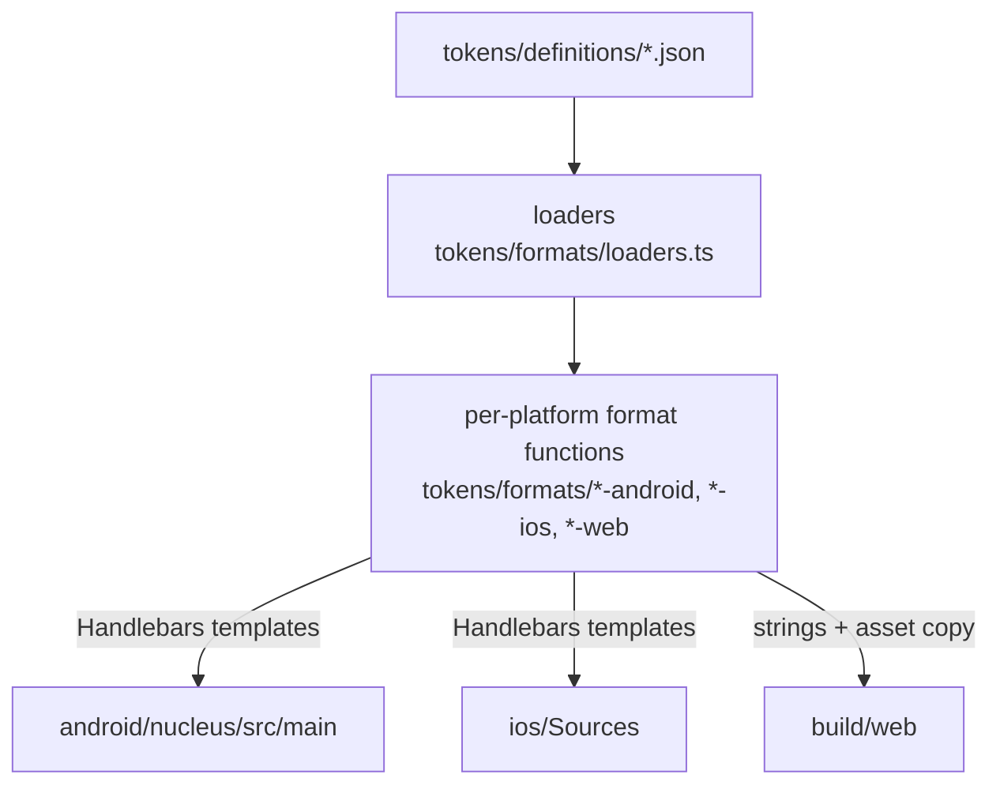

# Nucleus

A cross-platform design system for the World ecosystem. Nucleus publishes design tokens (colors, typography) and a small set of components as platform-native packages for Android, iOS, and web.

- [Architecture](#architecture)
- [Quick start](#quick-start)
- [Token reference](#token-reference)
  - [Color tokens](#color-tokens)
  - [Typography tokens](#typography-tokens)
- [Consuming Nucleus](#consuming-nucleus)
- [Adding or modifying tokens](#adding-or-modifying-tokens)
- [Releases](#releases)

## Architecture

Tokens are authored as JSON in `tokens/definitions/`. A TypeScript build pipeline reads the JSON through a validating loader, runs format-specific generators, and writes platform-native source files into the repo. The generated files are committed; CI verifies they are in sync with the source JSON on every PR.



**Design principles**

- **JSON is the single source of truth.** Every platform output is derived from the same JSON; nothing is hand-edited downstream.
- **Source layers are explicit in token paths.** Color tokens live under `primitive.color.*` and `semantic.color.*`. Font tokens are split into a `families` block (font files) and a `tokens` block (typography styles).
- **Platform outputs are standalone.** No app-specific dependencies. Android gets Compose `Color` / `NucleusFontStyle` values; iOS gets a `NucleusColor` struct and a `NucleusFont` struct; web gets CSS custom properties + JSON.
- **Generated files are committed.** CI runs `npm run build` then `git diff --exit-code` to ensure the source and generated outputs stay in sync.

## Quick start

```bash
npm ci
npm run build
```

Generated files appear in:

| Platform | Path                                                | Contents                                                                |
| -------- | --------------------------------------------------- | ----------------------------------------------------------------------- |
| Android  | `android/nucleus/src/main/java/com/worldcoin/nucleus/tokens/` | Kotlin objects (`NucleusPrimitiveColors`, `NucleusSemanticColorsLight`/`Dark`, `NucleusFonts`) shipped in the `android/nucleus` Maven artifact |
| Android  | `android/nucleus/src/main/res/font/`                | Bundled font files (`.ttf`)                                             |
| iOS      | `ios/Sources/NucleusColors/`                        | `NucleusColor` struct + generated `NucleusColor+Primitives.swift` and `NucleusColor+Semantics.swift` (SPM library `NucleusColors`) |
| iOS      | `ios/Sources/NucleusFonts/`                         | `NucleusFont` struct + generated `NucleusFont+Defaults.swift` and bundled font resources (SPM library `NucleusFonts`) |
| Web      | `build/web/`                                        | CSS custom properties (`nucleus-*.css`), JSON token files, font files, `package.json` for npm publishing |

The repo-root `VERSION` file is the canonical version. `npm run build` stamps it into the web `package.json`; the Android library reads it from `build.gradle.kts`; SPM consumes the SPM tag.

## Token reference

### Color tokens

Colors are layered:

- **Primitive** (`primitive.color.*`) — raw palette values (e.g. `grey.500`, `red.700`). Use only when no semantic token fits.
- **Semantic** (`semantic.color.*`) — purpose-named tokens that adapt to theme (e.g. `surface.primary`, `text.primary`). Prefer these in product code so light/dark swap automatically.

Source: `tokens/definitions/color/primitive.json`, `tokens/definitions/color/semantic.light.json`, `tokens/definitions/color/semantic.dark.json`.

### Typography tokens

Source: `tokens/definitions/font/fonts.json`.

Typography is organized into six **categories**, each with one or more sizes (1 = largest within the category).

| Category | Prefix | Sizes used today | Intended use                                                                             |
| -------- | ------ | ---------------- | ---------------------------------------------------------------------------------------- |
| Display  | `d`    | `d1`             | Hero / marketing-scale text.                                                             |
| Numeric  | `n`    | `n1`–`n5`        | Large numeric readouts (balances, scores, counters) — semibold weight, tighter tracking. |
| Heading  | `h`    | `h1`–`h4`        | Section and view titles. Decreasing prominence from `h1` to `h4`.                        |
| Subtitle | `s`    | `s1`–`s4`        | Secondary headings or emphasized labels. Medium weight.                                  |
| Label    | `l`    | `l1`–`l3`        | Buttons, chips, captions, badge text. Semibold weight.                                   |
| Body     | `b`    | `b1`–`b4`        | Paragraph and content text. Lighter weight (325), looser line height (1.3).              |

**Picking a token.** Start from the *category* (what role does this text play?), then choose the *size* that matches the visual hierarchy of the screen. Don't mix categories at the same hierarchy level on one screen.

Each token carries: `family` (font file), `size` (pt / sp / px), `weight` (variable axis value, typically 300–800), `letterSpacing` (em multiplier), `lineHeight` (em multiplier), and an optional `dynamicTypeStyle` for iOS Dynamic Type scaling.

> TODO: the category names (Display, Numeric, Heading, etc.) are inferred from prefix conventions; double check with design on canonical names.

## Consuming Nucleus

<details>
<summary><b>Android</b></summary>

Add the GitHub Packages Maven repository to `settings.gradle.kts`:

```kotlin
maven {
    url = uri("https://maven.pkg.github.com/worldcoin/nucleus")
    credentials {
        username = System.getenv("GITHUB_USER")
        password = System.getenv("GITHUB_TOKEN")
    }
}
```

Then add the dependency:

```kotlin
implementation("com.worldcoin:nucleus:<version>")
```

**Colors**

```kotlin
import com.worldcoin.nucleus.tokens.NucleusPrimitiveColors
import com.worldcoin.nucleus.tokens.NucleusSemanticColorsLight

val grey = NucleusPrimitiveColors.grey900
val surface = NucleusSemanticColorsLight.surfacePrimary
```

**Typography**

```kotlin
import androidx.compose.material3.Text
import androidx.compose.ui.text.TextStyle
import com.worldcoin.nucleus.tokens.NucleusFonts

val style = with(NucleusFonts.b1) {
    TextStyle(
        fontFamily = fontFamily,
        fontSize = fontSize,
        fontWeight = fontWeight,
        letterSpacing = letterSpacing,
        lineHeight = lineHeight,
    )
}

Text("Hello", style = style)
```

`NucleusFonts.<token>.fontFamily` is wired to the bundled font resource — no `R.font.*` lookup needed.

</details>

<details>
<summary><b>iOS</b></summary>

Add the SPM dependency in your `Package.swift`:

```swift
.package(url: "https://github.com/worldcoin/nucleus.git", branch: "generated/ios")
```

Or pin to a specific release tag (e.g. `vX.Y.Z-ios`). Then add the libraries you need as target dependencies:

```swift
.target(
    name: "YourTarget",
    dependencies: [
        .product(name: "NucleusColors", package: "nucleus"),
        .product(name: "NucleusFonts", package: "nucleus"),
    ]
)
```

**Colors**

```swift
import NucleusColors
import SwiftUI

Text("Hello")
    .foregroundStyle(NucleusColor.surfacePrimary.color) // adapts to light/dark
    .background(NucleusColor.grey900.color)             // primitive
```

**Typography**

```swift
import NucleusFonts
import SwiftUI

// Register bundled fonts once at app launch.
NucleusFont.registerFonts()

Text("Hello")
    .font(NucleusFont.b1.asFont())
```

`NucleusFont` supports variable weight axis, monospaced digits, and Dynamic Type. See `ios/Sources/NucleusFonts/NucleusFont.swift` for the full API.

</details>

<details>
<summary><b>Web</b></summary>

Add a `.npmrc` to your project:

```
@worldcoin:registry=https://npm.pkg.github.com
```

Then install:

```bash
npm install @worldcoin/nucleus
```

**Colors**

```css
@import "@worldcoin/nucleus/nucleus-primitive-colors.css";
@import "@worldcoin/nucleus/nucleus-semantic-colors-light.css";

.card {
  color: var(--nucleus-text-primary);
  background: var(--nucleus-surface-primary);
  border: 1px solid var(--nucleus-grey-200);
}
```

**Typography**

```css
@import "@worldcoin/nucleus/nucleus-fonts.css";

@font-face {
  font-family: "WorldProMVPLH-Regular";
  src: url("@worldcoin/nucleus/fonts/WorldProMVP.ttf") format("truetype");
}

.headline {
  font-family: var(--nucleus-font-h1-family);
  font-size: var(--nucleus-font-h1-size);
  font-weight: var(--nucleus-font-h1-weight);
  letter-spacing: var(--nucleus-font-h1-letter-spacing);
  line-height: var(--nucleus-font-h1-line-height);
}
```

**JSON tokens (for JS/TS)**

```ts
import colors from "@worldcoin/nucleus/nucleus-primitive-colors.json";
import fonts from "@worldcoin/nucleus/nucleus-fonts.json";
```

</details>

## Adding or modifying tokens

1. Edit the relevant JSON file in `tokens/definitions/`. The loader validates the shape at build time and throws a clear error if a field is missing or malformed.
2. Run `npm run build` to regenerate platform sources and verify output.
3. Commit both the source change *and* the regenerated files (CI enforces this with `git diff --exit-code`).
4. Open a PR with a release label (`patch`, `minor`, or `major`).

For new typography tokens: add the font file to `tokens/definitions/font/`, declare it in the `families` block of `fonts.json`, then reference it from the token. The Android resource name is derived by snake-casing the filename.

## Releases

Release automation is split across two workflows:

- `.github/workflows/prepare-release.yml` — prepares release PRs
- `.github/workflows/publish-release.yml` — tags and publishes merged release PRs

The prepare workflow runs in two modes:

- **Push to `main`** after merging a PR with a release label (`major`, `minor`, `patch`) — the workflow derives the bump from the merged PR, creates a `release/v*` branch, and opens a release PR.
- **Manual dispatch** — choose the bump type from the Actions UI to create the same release PR flow without a source PR label.

If the computed tag already exists, `prepare-release.yml` skips instead of opening a duplicate.

### Pipeline steps

1. **Release PR creation** — `prepare-release.yml` determines the next version, updates `VERSION`, `package.json`, `package-lock.json`, and `CHANGELOG.md`, then opens a `release/v*` PR.
2. **Release PR merge** — merging that PR back into `main` triggers `publish-release.yml`.
3. **Tag + build** — the merged release commit is tagged as `v*`, then `npm run build` runs and uploads `android-tokens`, `ios-tokens`, and `web-tokens`.
4. **publish-mvn** — publishes Android library to GitHub Packages.
5. **publish-spm** — commits generated iOS files to the `generated/ios` branch, tags as `v*-ios`.
6. **publish-npm** — publishes web package to GitHub Packages npm registry.

`publish-release.yml` only publishes the first time it creates the `v*` tag. Reruns after that tag exists skip the publish jobs.

The verification workflow (`.github/workflows/verify.yml`) runs `format:check`, `lint`, `typecheck`, `build`, and the codegen-in-sync check on every push to `main` and every PR.

## Example apps

- `examples/android/` — Android demo with `local` and `package` flavors
- `examples/ios/` — iOS demo with `Local` and `Package` schemes
- `examples/web/` — Next.js demo with `local` and `package` token sources
